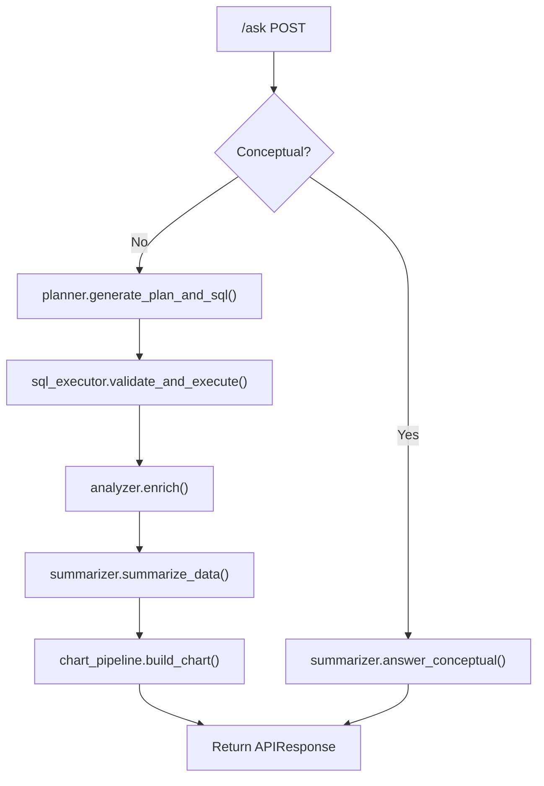

# Architectural Assessment: langchain_railway Rebuild (Final)

## Agreed Position

After two rounds of analysis, here's what we converge on:

| Point | Resolution |
|---|---|
| FAISS for 8 topics | Overkill. Markdown + topic registry. |
| Pipeline extraction first | Correct sequencing. Testable stages before architecture changes. |
| Agent latency | 2 rounds with parallel tool dispatch ≈ current 2-call pattern. Not a latency regression. |
| 30+ typed tools | Wrong framing. 4–5 high-frequency tools cover ~80% of queries. |
| Pipeline alone fixes quality | **No.** It improves maintainability but the SQL hallucination ceiling stays. |
| Typed tools fix the ceiling | **Yes, for covered patterns.** SQL gen fallback + validation chain stays for the rest. |

---

## Component Disposition

| Component | Keep? | Action |
|---|---|---|
| [analysis/stats.py](file:///d:/Enaiapp/langchain_railway/analysis/stats.py), [seasonal.py](file:///d:/Enaiapp/langchain_railway/analysis/seasonal.py), [shares.py](file:///d:/Enaiapp/langchain_railway/analysis/shares.py) | ✅ Keep | Unchanged |
| [core/query_executor.py](file:///d:/Enaiapp/langchain_railway/core/query_executor.py) | ✅ Keep | Unchanged |
| [core/sql_generator.py](file:///d:/Enaiapp/langchain_railway/core/sql_generator.py) | ✅ Keep | Used by SQL fallback path AND inside typed tools |
| [context.py](file:///d:/Enaiapp/langchain_railway/context.py), [config.py](file:///d:/Enaiapp/langchain_railway/config.py), [models.py](file:///d:/Enaiapp/langchain_railway/models.py) | ✅ Keep | Unchanged (add `QueryContext` to models) |
| [utils/language.py](file:///d:/Enaiapp/langchain_railway/utils/language.py), [metrics.py](file:///d:/Enaiapp/langchain_railway/utils/metrics.py), [query_validation.py](file:///d:/Enaiapp/langchain_railway/utils/query_validation.py) | ✅ Keep | Unchanged |
| [visualization/chart_builder.py](file:///d:/Enaiapp/langchain_railway/visualization/chart_builder.py), [chart_selector.py](file:///d:/Enaiapp/langchain_railway/visualization/chart_selector.py) | ✅ Keep | Called from `chart_pipeline.py` |
| `legacy domain knowledge module` (removed) | ✅ Completed | Content migrated to Markdown files in [knowledge/](file:///d:/Enaiapp/langchain_railway/knowledge/__init__.py) |
| `legacy prompt examples module` (removed) | ✅ Completed | Content moved to [sql_examples.md](file:///d:/Enaiapp/langchain_railway/knowledge/sql_examples.md) and [sql_example_selector.py](file:///d:/Enaiapp/langchain_railway/knowledge/sql_example_selector.py) |
| [main.py](file:///d:/Enaiapp/langchain_railway/main.py) `/ask` handler | Discard | Replace with pipeline -> then agent orchestrator |
| [core/llm.py](file:///d:/Enaiapp/langchain_railway/core/llm.py) prompt logic | Refactor | Keep cache/retry/singletons; extract prompt templates |
| `legacy aggregation helper module` (removed) | ✅ Completed | Aggregation helpers moved to [aggregation.py](file:///d:/Enaiapp/langchain_railway/agent/aggregation.py) |
| 7-step SQL validation chain | ✅ Keep | Guards the SQL-generation fallback path |

---

## The 5-Phase Plan

### Phase 1 - Knowledge Migration (2 days)

**Goal**: Replace the legacy domain knowledge module (removed) with Markdown files + topic registry.

```
knowledge/
 __init__.py              # Topic registry + load_knowledge()
 balancing_price.md       # From "price_with_usd" + "CurrencyInfluence" sections
 market_structure.md      # From "trade_derived_entities" sections
 tariffs.md               # From "tariff_entities" section
 cfd_ppa.md               # From "CfD_Contracts" section
 seasonal_patterns.md     # From seasonal analysis context
 generation_mix.md        # From "tech_quantity_view" + energy balance sections
 currency_influence.md    # From "CurrencyInfluence" + "GEL_USD_Effect"
 general_definitions.md   # From "GeneralDefinitions" section
 sql_examples.md          # Migrated from the legacy prompt examples module
```

**What changes**: [core/llm.py](file:///d:/Enaiapp/langchain_railway/core/llm.py)'s [get_relevant_domain_knowledge()](file:///d:/Enaiapp/langchain_railway/main.py#737-906) calls `knowledge.get_knowledge_for_topics()` instead of filtering the Python dict.

**What doesn't change**: The LLM still gets the same information in the same place in the prompt. Answer quality is unchanged.

**Ceiling after Phase 1**: Maintainability improved (add knowledge by adding .md files). Quality unchanged.

---

### Phase 2  Pipeline Extraction (3 days)

**Goal**: Decompose [ask_post](file:///d:/Enaiapp/langchain_railway/main.py#1465-2978) (lines 1465–2977) into 5 testable stages.

```
agent/
 __init__.py
 pipeline.py              # Orchestrator (~80 lines)
 planner.py               # LLM plan+SQL generation (~150 lines)
 sql_executor.py           # Validation + execution + error recovery (~200 lines)
 analyzer.py              # Share analysis, correlation, seasonal stats (~150 lines)
 summarizer.py            # LLM answer synthesis + conceptual answers (~100 lines)
 chart_pipeline.py        # Chart type selection + data formatting (~250 lines)
```



**[main.py](file:///d:/Enaiapp/langchain_railway/main.py) becomes ~120 lines**: FastAPI app, middleware, CORS, rate limiting, and a single call to `pipeline.process_query()`.

**Ceiling after Phase 2**: Code is modular and testable. Each stage can be validated independently. **Quality ceiling unchanged**  same SQL generation, same validation chain, same context selection.

---

### Phase 3  Typed Domain Tools (1 week)

**Goal**: Replace SQL generation with typed tools for the **top 5 query patterns**. These cover ~80% of real traffic.

```
agent/tools/
 __init__.py               # Tool registry
 price_tools.py            # get_prices(start, end, currency)
 composition_tools.py      # get_balancing_composition(start, end)
 tariff_tools.py           # get_tariffs(start, end, entities?)
 generation_tools.py       # get_generation_mix(start, end, types?)
 stats_tools.py            # compute_correlation(), compute_trend()
```

**How it works**: The planner detects whether the query fits a typed tool. If yes  ’ call the tool directly (no SQL generation, no validation chain). If no  ’ fall through to SQL generation path (existing logic, still guarded).

```python
# agent/planner.py (Phase 3 addition)
def route_query(ctx: QueryContext) -> QueryContext:
    """Decide: typed tool or SQL generation?"""
    tool = match_tool(ctx.query, ctx.plan)
    if tool:
        ctx.tool_result = tool.execute(ctx.plan)  # No SQL gen needed
        ctx.df = tool_result_to_dataframe(ctx.tool_result)
        ctx.used_tool = True
    else:
        ctx = generate_plan_and_sql(ctx)  # Existing SQL path
        ctx.used_tool = False
    return ctx
```

**What this fixes**:
- SQL hallucinations  ’ **zero** for the 80% of queries handled by typed tools
- Validation chain  ’ **unnecessary** for tool-handled queries
- Context selection  ’ tools embed the correct SQL, so the LLM doesn't need to be told which tables/columns to use

**What this doesn't fix**: The 20% of open-ended queries that still need SQL generation keep the current quality ceiling. The validation chain stays active for those.

**Ceiling after Phase 3**: 80% of queries are reliable by construction. 20% have current quality level.

---

### Phase 4  Agent Loop (Future, ~1 week when ready)

**Goal**: Replace `pipeline.py` linear orchestrator with an agent loop that can call multiple tools per round.

```python
# agent/orchestrator.py (replaces pipeline.py)
TOOLS = [get_prices, get_composition, get_tariffs, get_generation_mix,
         compute_correlation, compute_trend, search_knowledge,
         generate_sql_query]  #   SQL gen becomes a tool, not the default

async def run_analyst(query, lang_instruction, history):
    llm = ChatGoogleGenerativeAI(model="gemini-2.5-flash").bind_tools(TOOLS)
    messages = [SystemMessage(SYSTEM + lang_instruction)] + [HumanMessage(query)]
    
    for _ in range(4):  # max 4 rounds
        response = await llm.ainvoke(messages)
        if not response.tool_calls: break
        
        # Parallel execution of all requested tools
        results = await asyncio.gather(*[
            execute_tool(tc) for tc in response.tool_calls
        ])
        messages.extend(tool_messages(response.tool_calls, results))
    
    return AgentResponse(answer=response.content, ...)
```

**Key difference from Phase 3**: The LLM *chooses* which tools to call, including calling multiple tools in one round (e.g., `get_prices()` AND `get_composition()` simultaneously). `generate_sql_query` is available as a last-resort tool for unusual queries.

**Prerequisites**: Phases 1–3 complete and stable. LangChain dependencies may need upgrading for native tool-calling support.

---

### Phase 5 Cleanup

- ✅ Deleted legacy domain knowledge module (content migrated to `knowledge/*.md`)
- ✅ Deleted legacy prompt examples module (content migrated to `knowledge/sql_examples.md` and `knowledge/sql_example_selector.py`)
- Remove dead code paths from [core/llm.py](file:///d:/Enaiapp/langchain_railway/core/llm.py)
- ✅ Removed legacy aggregation helper module (helpers moved to `agent/aggregation.py`)
- Update all tests

---

## Quality Ceiling by Phase

| Phase | SQL Hallucinations | Code Maintainability | Adding Knowledge | Answer Quality |
|---|---|---|---|---|
| Current | Frequent | Poor (3,000-line file) | Code deploy | Baseline |
| After Phase 1 | Same | Improved (knowledge as .md) | Add .md file | Same |
| After Phase 2 | Same | Good (5 testable stages) | Add .md file | Same |
| After Phase 3 | **Zero for 80%**, same for 20% | Good | Add .md file + optional tool | **Improved** |
| After Phase 4 | **Zero for 80%**, guarded for 20% | Good | Add .md file + tool | **Best** |

---

## What Stays Exactly As-Is Through All Phases

- [core/query_executor.py](file:///d:/Enaiapp/langchain_railway/core/query_executor.py)  security, pooling, timeouts (called by both tools and SQL path)
- [core/sql_generator.py](file:///d:/Enaiapp/langchain_railway/core/sql_generator.py)  whitelist checker (used by SQL fallback path AND inside typed tools)
- [analysis/stats.py](file:///d:/Enaiapp/langchain_railway/analysis/stats.py), [seasonal.py](file:///d:/Enaiapp/langchain_railway/analysis/seasonal.py), [shares.py](file:///d:/Enaiapp/langchain_railway/analysis/shares.py)  called by `analyzer.py` and `stats_tools.py`
- [utils/language.py](file:///d:/Enaiapp/langchain_railway/utils/language.py), [metrics.py](file:///d:/Enaiapp/langchain_railway/utils/metrics.py), [query_validation.py](file:///d:/Enaiapp/langchain_railway/utils/query_validation.py)
- [context.py](file:///d:/Enaiapp/langchain_railway/context.py), [config.py](file:///d:/Enaiapp/langchain_railway/config.py), [models.py](file:///d:/Enaiapp/langchain_railway/models.py)
- PostgreSQL database and all views  untouched
- Rate limiting, API key auth, CORS
